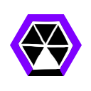

HowToPlay
====

시놉시스
----
청소기 분야에서 최고 기술력을 가진 nosyd. 이미 몇 년 전부터 지능형 로봇 청소기를 연구하고 개발해왔다. 현재 시장에 출시된 로봇 청소기는 이미 오래 전에 완성한 초기형 버전. nosyd에서는 이미 몇백배 발전한 로봇 청소기들의 완제품들을 만들어놓고 지속적인 개선을 이루고 있다. 
nosyd의 내부적인 로봇 청소기 개선 방법은 바로 유전 알고리즘이다. 세대를 반복하며 더욱 지능화된 행동방식을 가진 로봇 청소기를 선택하고, 그렇게 선택된 청소기들을 기반으로 다음 세대를 만들어내는 방식이다. 그리고 그 핵심에는 경쟁이 있다. 로봇 청소기 간의 경쟁을 통해 승리한 쪽이 선택되고, 그렇지 못한 쪽은 도태된다. 
오늘도 nosyd의 로봇 청소기 대전이 이루어진다. 과연 최종 출하될 로봇 청소기는 어떤 모습이 될지...

게임의 목표
----
적 로봇을 부수고 쓰레기를 모아 상대 진영에 더 강력한 로봇을 소환하세요. 
먼저 상대 팀의 로봇 청소기를 모두 파괴하면 승리하는 서바이벌 게임입니다.

기본 조작법
----
* 이동 : WASD
* 총알 발사 : 마우스 왼쪽 클릭
* 상대 팀 화면 보기 : TAB
* 채팅 : ENTER
* 업그레이드
  * 업그레이드 창 열기 : LEFT SHIFT
  * 업그레이드 하기 : F1 ~ F4
* 유닛 보내기 : 숫자 1~4

로봇 청소기 종류
----
* D2
 

* Allergy
 

* Pesticide
 

스폰할 수 있는 로봇들
----
* Basic
 

: 가장 기본적인 적 유닛으로 로봇 청소기를 따라다니며 몸통 박치기 공격을 합니다.

* Follow
 

: 로봇 청소기를 향해서 총알을 발사하면서 다가오는 로봇입니다.

* Spiral
 

: 움직이지 않으며, 제자리에서 원형의 탄막을 발사합니다.

* Explode
 

: 매우 빠르게 다가오며, 죽을 경우 원형의 탄막을 뿌리면서 죽는 자폭 유닛입니다.
