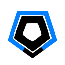

HowToPlay
====

게임의 목표
----
적 로봇을 부수고 쓰레기를 모아 상대 진영에 더 강력한 로봇을 소환하세요. 
먼저 상대 팀의 로봇 청소기를 모두 파괴하면 승리하는 서바이벌 게임입니다.

기본 조작법
----
* 이동 : WASD
* 총알 발사 : 마우스 왼쪽 클릭
* 상대 팀 화면 보기 : TAB
* 채팅 : ENTER
* 업그레이드
  * 업그레이드 창 열기 : LEFT SHIFT
  * 업그레이드 하기 : F1 ~ F4
* 유닛 보내기 : 숫자 1~4

로봇 청소기 종류
----
* D2
 

* Allergy
 

* Pesticide
 

스폰할 수 있는 로봇들
----
* Basic
 

가장 기본적인 적 유닛으로 로봇 청소기를 따라다니며 몸통 박치기 공격을 합니다.

* Follow
 

로봇 청소기를 향해서 총알을 발사하면서 다가오는 로봇입니다.

* Spiral
 

움직이지 않으며, 제자리에서 원형의 탄막을 발사합니다.

* Explode
 

매우 빠르게 다가오며, 죽을 경우 원형의 탄막을 뿌리면서 죽는 자폭 유닛입니다.
